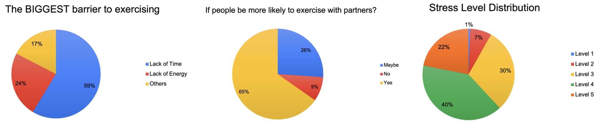
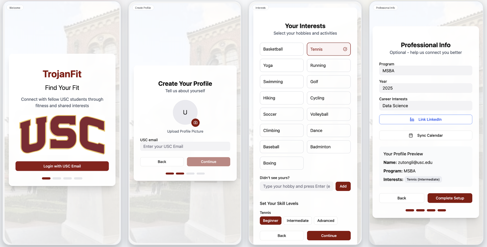

# TrojanFit
**AI Wellness & Fitness Community App Prototype (Case Competition)**

TrojanFit is an **AI-enabled wellness and fitness networking app prototype** designed to help students discover activities, coordinate with peers, and take action under real schedule constraints.

Instead of treating wellness as a content problem, TrojanFit focuses on **activation** — reducing the friction between *wanting to be active* and *actually joining an activity*.

---

## Project Snapshot

- **Type:** AI product / case competition / prototype
- **Focus:** AI personalization + social activation + schedule-aware recommendations
- **Artifacts:** Figma prototype, case slides, survey-based user research
- **Target Users:** USC students (initial concept tested with USC MSBA cohort)

### Links
- **Figma Prototype:** [TrojanFit App Design (Figma)](https://www.figma.com/make/vkWLbnDg35jP7ZxdH1Agvz/TrojanFit-App-Design?fullscreen=1&t=aAO8ZtbcfYSlinPy-1)
- **Case Slides:** [TrojanFit App Case Slides](slides/AI_Case_Competition_TrojanFit.pdf)

---

## Overview

TrojanFit is a **community and AI-driven fitness platform** that combines:

- **Personalized event discovery**
- **Schedule-aware recommendations**
- **Social coordination and accountability**
- **Campus-centered wellness engagement**

The goal is to make wellness participation more **actionable, social, and sustainable** — not just informative.

---

## Why This Opportunity Exists (User Research)

We conducted a survey with **USC MSBA students (N=46)** to understand barriers to wellness and fitness engagement.

### Key Insights
- **83%** reported barriers related to **time and energy**
- **Average stress level = 4/5** (High / Very High)
- **55%** reported stronger activation when they had **social partners**
- Students responded positively to the idea of an **AI + community-driven** wellness platform

> **Design implication:** TrojanFit was framed not as another tracker, but as an **activation system** that combines AI recommendations with social and scheduling support.

*Figure: Survey insights used to identify activation barriers and inform feature design.*

---

## Product Concept

TrojanFit helps students:

- **Discover** relevant activities and events
- **Get recommendations** based on preferences and schedule
- **Coordinate** with peers for accountability
- **Act quickly** with less planning friction

### Core Product Thesis
TrojanFit uses AI as a **workflow layer** to support decision-making and follow-through — not just as a chatbot feature.

---

## How It Works (High-Level User Journey)

*Figure: High-level user journey from onboarding and preference setup to AI matching and social participation.*

---

## Core Features (Prototype Scope)

### 1) Onboarding & Personalization

Builds the personalization foundation by collecting user context:
- USC sign-in and profile setup
- Interests and skill levels (e.g., Beginner / Intermediate / Advanced)
- Professional / demographic inputs (optional)
- Calendar sync entry point

*Figure: Onboarding and profile personalization workflow, including USC login, profile setup, interest selection, skill configuration, and optional profile details.*

---
### Interface Overview

*Figure: Core interface surfaces shown after onboarding, including Feed, Calendar, Map, and Profile/Chat experiences.*

---

### 2) Intelligent Home Feed
A personalized “mission control” feed designed to reduce search effort and increase action.
- Trending and nearby activities
- Personalized recommendations
- Category filters (e.g., basketball, tennis, yoga)
- Fast event cards with quick decision cues

---

### 3) AI Recommendations + Calendar Integration
TrojanFit uses availability and preferences to recommend activities that fit the user’s real schedule.
- Weekly planning interface
- Availability-aware activity suggestions
- Calendar sync to reduce scheduling friction
- Agenda visibility to support follow-through

---

### 4) AI-Powered Search
Natural-language search helps users discover activities more efficiently.
- Query-based event discovery
- Contextual search intent (e.g., activity type, time, location)
- Reduced planning friction through faster filtering

---

### 5) Interactive Map Experience
Map-based exploration supports location-aware discovery and quick action.
- Nearby events displayed as pins
- Clickable event details and previews
- Navigation-friendly event exploration
- Integration of fitness + networking opportunities

---

### 6) Social Layer: Event Setup, Groups, and Chat
TrojanFit includes a social coordination layer to improve accountability and retention.
- Create sports or networking events
- Manage event details (time, venue, participants)
- Profile and group chat features
- Event history, skill level visibility, and participation status

---

## AI Product Logic (How AI Creates Value)

TrojanFit uses AI as a **decision-support and activation layer** across the user workflow.

### High-Level AI Flow
1. **Collect user signals**  
   (profile, skill level, preferences, availability)
2. **Interpret context**  
   (time constraints, activity type, schedule fit)
3. **Generate recommendations**  
   (events / activities likely to be relevant and actionable)
4. **Present options through product surfaces**  
   (feed, search, map, calendar)
5. **Support follow-through**  
   (social connection, event setup, chat, reminders)

> This design combines **personalization + behavioral activation + social accountability**.

---

## Competitive Positioning

TrojanFit sits between:
- **Fitness-focused platforms** (tracking / classes / training)
- **Social/community platforms** (connection without wellness-specific activation logic)

### Differentiation
- **Fitness + networking** in one experience
- **Trojan/USC-centered community focus**
- **AI-powered scheduling and recommendation workflow**
- **Action-first design** (reduce planning friction, increase participation)

---

## GTM / Business Thinking (Early Concept)

### Launch Strategy (Phased)
- **Pre-launch:** recruit seed users, prototype testing, feedback loop
- **Official launch:** MSBA community activation and campus pilots
- **Expansion:** partnerships, product iteration, broader student adoption

### Candidate Acquisition Channels
- Student social media / creator-led promotion
- MSBA email loop and cohort communities
- On-campus flyers and events
- Clubs and campus partnerships

### Early Business Model Ideas
- B2B sponsorships
- Event-host commission fees
- Campus partnership programs

---

## Success Metrics (KPI Framework)

### User Acquisition
- Download rate
- Number of completed profiles

### Activation & Engagement
- Number of buddy matches made
- Number of events created / joined
- Daily Active Users (DAU)

### Retention
- Weekly retention rate
- Monthly retention rate

---

## My Contribution
I contributed across problem framing, product design, and AI workflow definition, with a focus on translating research insights into a usable prototype experience.
- Survey insight synthesis and problem framing
- Product feature ideation and prioritization
- AI recommendation workflow / logic framing
- Prototype flow design (Figma)
- Deck structuring and storytelling support

---

## Future Improvements

- Stronger personalization using longitudinal behavior data
- MVP analytics instrumentation for event funnels
- Experiment design for nudge timing and recommendation quality
- Expanded map coverage (on-campus + nearby neighborhoods)
- Club collaboration tools and admin workflows

